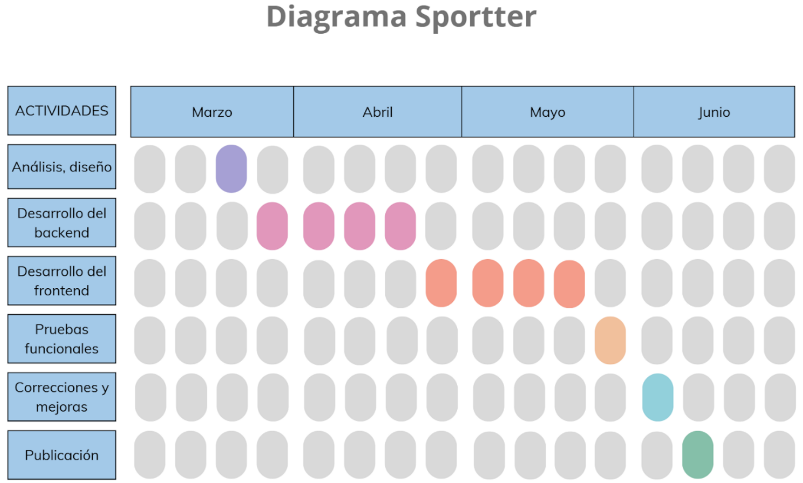

# Diagrama temporal

Empezamos decidiendo el tema del proyecto, a partir de ahí realizamos la estructura básica, unos bocetos de la aplicación, de la base de datos inicial y temas que usar en la aplicación y el logo.

A partir de ahí nos dividimos tareas y cada uno se ocupó de un tema, base de datos, diseño y funcionalidad de la base de datos en código, cuando tuvimos un mínimo los juntamos y fuimos avanzando.

Por último corregimos errores, haciendo pruebas, usando usuarios reales por terceros que probaron nuestra aplicación, pedimos feedback y lo implementamos.

## Cronograma del proyecto

| Semana | Actividad                  |
|--------|----------------------------|
| 1-2    | Análisis, diseño UI/UX     |
| 3-7    | Desarrollo del backend     |
| 8-10   | Desarrollo del frontend    |
| 11     | Pruebas funcionales        |
| 12     | Correcciones y mejoras     |
| 13     | Publicación                |

 

## Adversidades que se nos han planteado 

La primera adversidad que se nos presentó fue la elección de la base de datos ya que nos costó tiempo en encontrar la que hemos usado.

En general, el principal inconveniente fue tanto mensajería, ya que no la habíamos implementado nunca, como la llamada a la api de Spring para recoger los datos.

Hemos metido funcionalidades complicadas como han sido la seguridad en las rutas (no se puede entrar a la aplicación sin estar registrado), poder comentar una publicación o poder compartir una publicación a un usuario.

