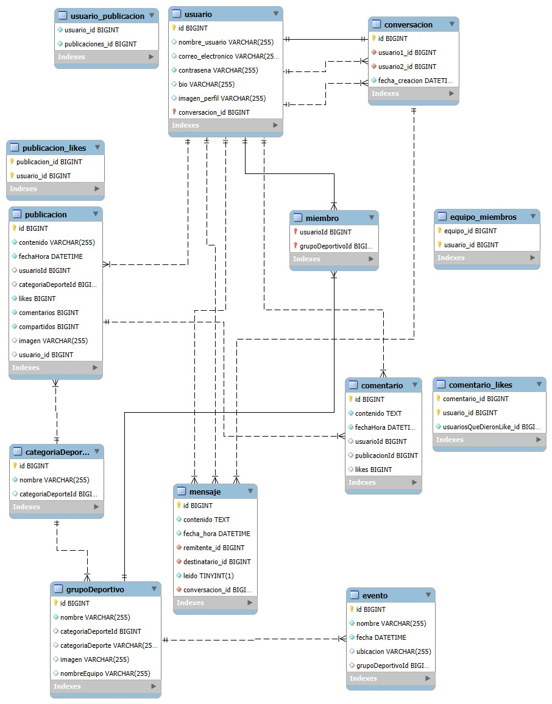
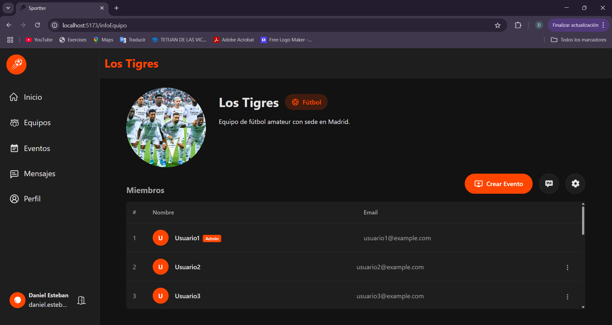
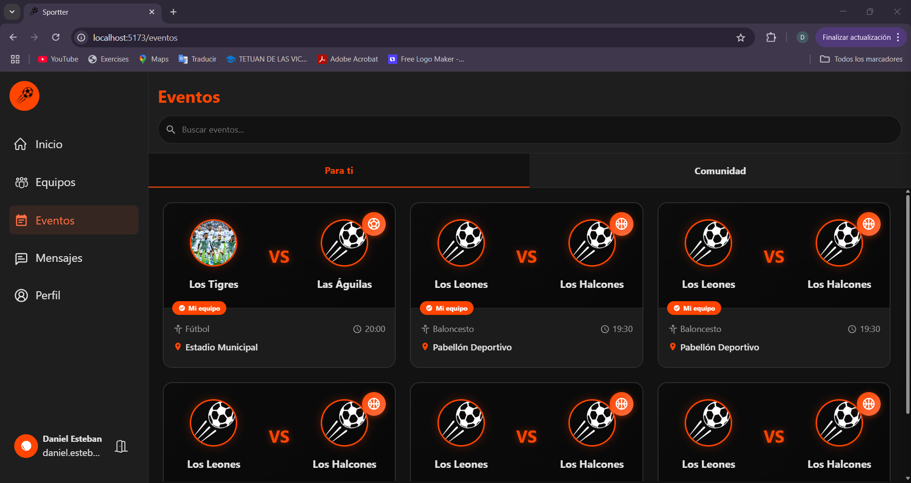

# Tareas 

Para garantizar un desarrollo ordenado y eficiente de la red social Sportter, el proyecto fue dividido en una serie de tareas bien definidas. Estas tareas se organizaron en distintas etapas progresivas, permitiendo un seguimiento claro del avance y facilitando la colaboración de todo el equipo. La estructura por fases también permitió identificar prioridades, distribuir responsabilidades y razonar posibles dificultades durante el proceso de implementación.

## Distribución del proyecto 

El trabajo comenzó con reuniones de planificación en las que se definieron los objetivos, se asignaron responsabilidades y se estableció la metodología de trabajo.

Durante esta etapa inicial, también se diseñó la estructura de la base de datos, identificando las entidades necesarias, sus relaciones y la lógica de almacenamiento de la información, lo cual fue fundamental para el correcto desarrollo posterior del sistema.

Una vez definido este esquema, se inició el diseño de interfaces, centrado en ofrecer una experiencia de usuario visualmente atractiva, funcional e intuitiva, adaptable tanto a dispositivos móviles como de escritorio. A continuación, se procedió al desarrollo del frontend, implementando las distintas vistas e interacciones de la página web.

Con la base de datos ya definida y terminado el diseño del frontend, comenzamos con el desarrollo del backend, donde se construyó la lógica del servidor, la gestión de la base de datos, los servicios y los sistemas de autenticación y comunicación interna.

Tras estas etapas, se realizaron pruebas para comprobar que cada funcionalidad cumpliera con su propósito, detectando errores o áreas de mejora. Después, se llevó a cabo una fase de revisión y corrección, enfocada en solucionar fallos, optimizar el rendimiento de la aplicación y garantizar la estabilidad de la plataforma antes de su despliegue.

## Diagramas 

### Diagrama modelo Entidad - Relación

### Diagrama de navegación (Casos de uso)

Al iniciar en la app, hay dos opciones: inicio de sesión y registro. 

- Inicio de sesión:

En caso de haber olvidado la contraseña, esta la opción de poder cambiarla con el email:

Se envía un código al correo:

Se verifica si el código es el correcto:

Se cambia la contraseña y redirige a inicio de sesión:

- Registro:

Otra vez en inicio de sesión nos da la opción de registrarnos, la contraseña se hashea en la base de datos y tiene varios requerimientos:

En este caso también se envía un correo de verificación para el usuario, exactamente igual al anterior.

- Pantalla principal:

Una vez iniciada sesión con el usuario, nos lleva a la pantalla principal:

Podemos ver un listado de publicaciones de todos los usuarios existentes ordenados por fecha más reciente, la opción más interesantes es la de creación de un post, para ello hay 2 formas, desde el botón de publicar o desde el recuadro en la parte superior central que indica _¿Qué está pasando?_:

En ella podemos escribir un el contenido de la publicación, agregar una imagen y elegir la categoría de deporte a la que pertenece (si tiene), ya está lista para publicarla:

Dentro de la pantalla principal podemos observar más funcionalidades, como el filtrado de las publicaciones por deporte, al cuál podemos acceder en el botón naranja que se ubica en la parte superior derecha de la pantalla:

En la parte derecha de la pantalla se ven 2 buscadores y un recolector de tendencias, las cuáles se recogen a partir de los # de las publicaciones. El buscador superior sirve para buscar entre las publicaciones cualquier palabra, letra, emoji, ..., mientras que el inferior abre un modal en el centro de la pantalla donde podemos buscar a cualquier usuario:

Si nos fijamos, en la parte izquierda de la pantalla podemos ver un menú de navegación con distintos apartados:

- _**Inicio**_: La pantalla actual, donde se muestran todas las publicaciones.

- _**Equipos**_: Donde se muestran tanto los equipos en los que el usuario sea miembro como todos los equipos existentes en la aplicación, con la opción de crear un nuevo equipo.

- _**Eventos**_: Lugar donde aparece un listado de los eeventos de los equipos a los que el usuario pertenece y otro listado con todos los eventos existentes en la aplicación.

- _**Mensajes**_: Apartado para mandar mensajes a cualquier usuario de la aplicación.

- _**Perfil**_: La pantalla donde se muestra la información del usuario.

La opción de cerrar sesión está debajo del botón de _Publicar_, al lado del usuario.

- Pantalla de equipos:

En esta pantalla se muestran los equipos a los que el usuario pertenece:

Y todos los equipos existentes en la aplicación:

Abajo a la derecha se divisa un botón naranja, que sirve para crear un nuevo equipo:

Se debe de poner un nombre, una descripción, seleccionar un deporte, una imagen (opcional) y meter usuarios (opcional):

Si creamos el equipo se añadirá a nuestro apartado de equipos:

Podemos ver la información del equipo si pinchamos encima de él:

En esta pantalla podemos ver la información del equipo, aparte nos muestra un listado de los miembros que componen al equipo. 

También muestra un botón de ajustes, el cuál muestra las opciones de poder añadir miembros, editar el equipo (si es admin), salir del equipo y borrar (si es admin). 

Los 2 botones restantes son de mensajería entre los miembros de grupo y de crear un evento para el equipo, vamos a crear un evento:

El evento se guardará en el apartado de _Eventos_.

- Pantalla de eventos:

En este apartado, al igual que en _Equipos_, se muestran los eventos a los que el usuario pertenece:

Y también todos los eventos existentes en la aplicación:

Si se pincha en un evento muestra la información del evento:

- Pantalla de mensajería:

Aquí vamos a poder enviar mensajes a cualquiera de los usuarios de la aplicación:

Si se pincha en un usuario se muestra la conversación entre el usuario y el usuario receptor:

Encima a la derecha del buscador de mensajes directos, se divisa un botón con un símbolo de +, si se pincha en él se abre una ventana para poder crear una conversación con cualquier usuario de la aplicación que no esté ya añadido:

Así se ve el usuario añadido:

- Pantalla de perfil:

En esta pantalla se muestra la información del usuario, también se ve un listado de publicaciones y de equipos:

Las publicaciones y equipos funcionan igual que en sus respectivas pantallas.

Si el perfil que se está viendo es del propio usuario, se muestra un botón de _Ajustes_, el cuál permite editar la información del usuario, cambiar la contraseña, borrar la cuenta y cerrar sesión:

Si intentamos desde la url acceder a otro usuario, podremos ver su perfil pero sin poder acceder a sus ajustes:

Si accedemos a un perfil que no existe, se muestra un mensaje de error:

### Diagrama de clases

En este apartado mostramos todas las clases usadas en cada uno de los controladores de las clases:

